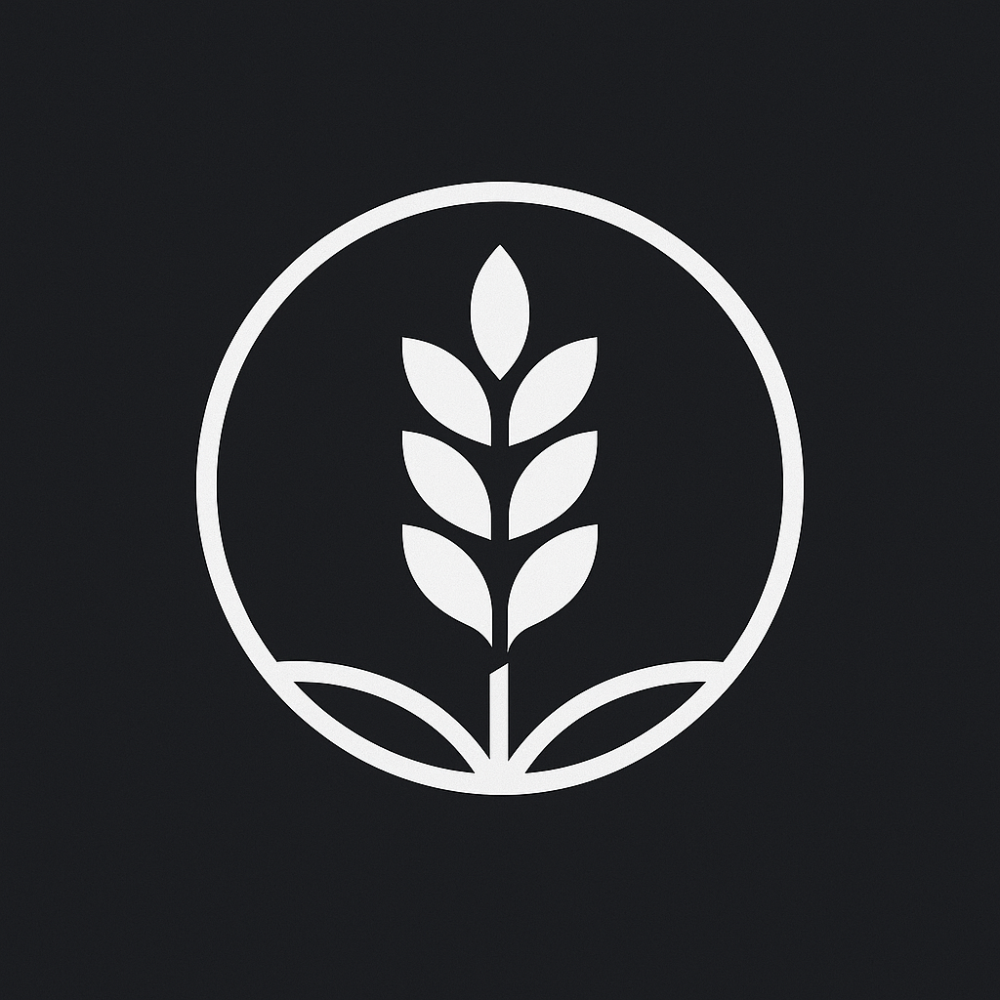
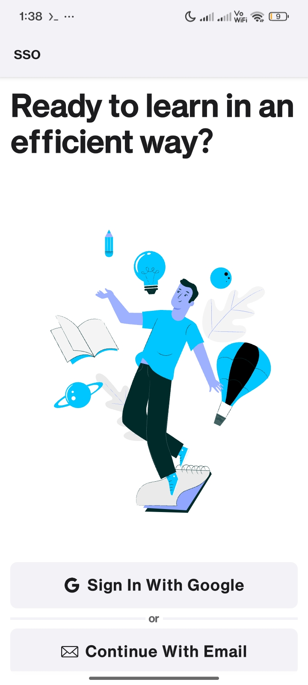
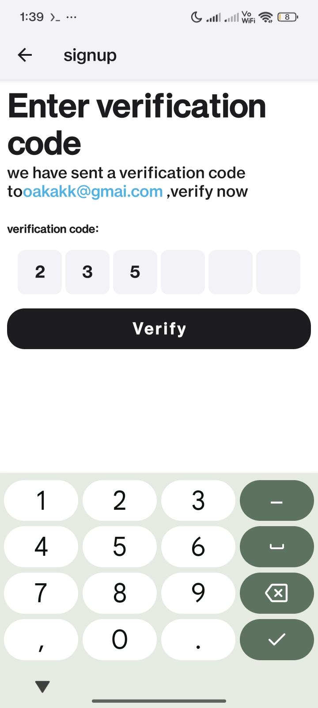
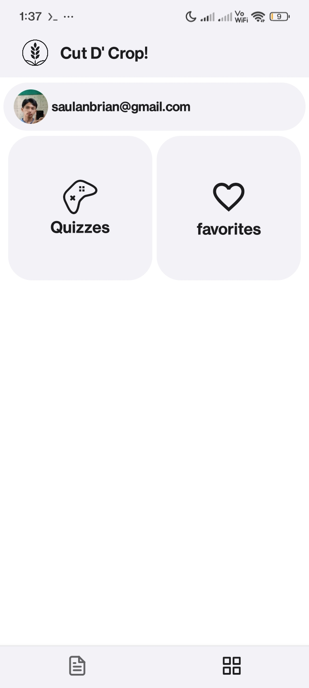
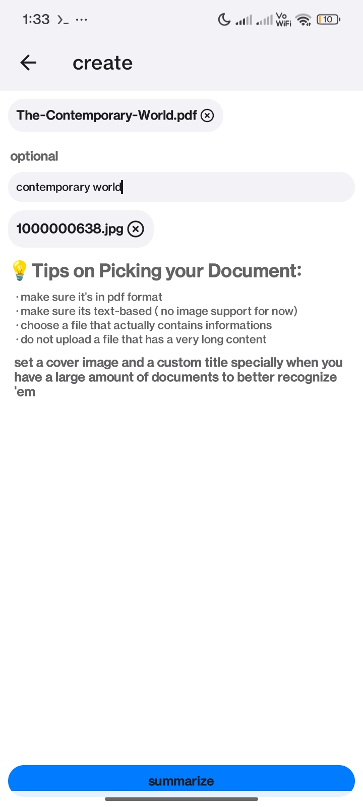
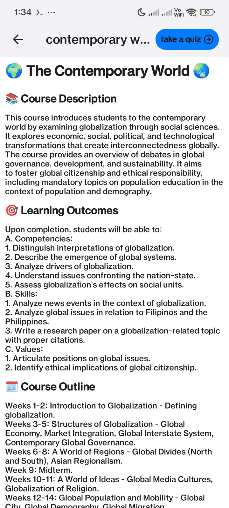
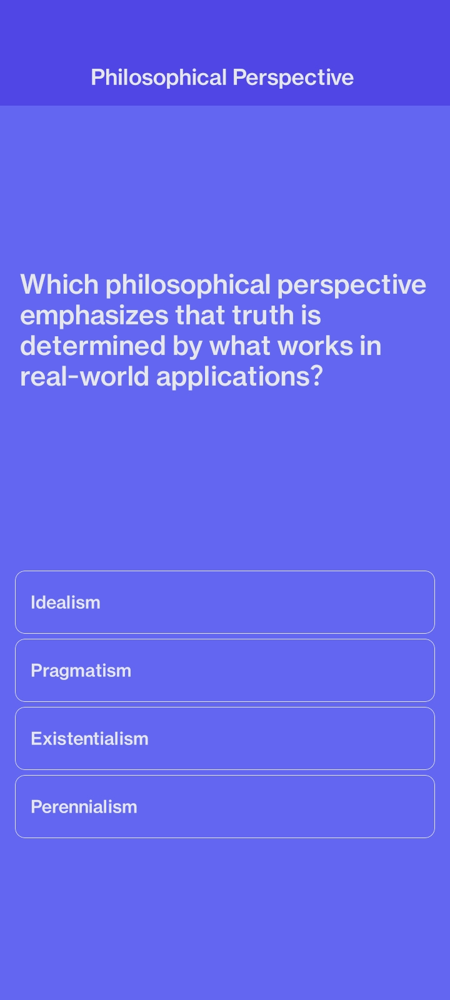

# Cut D' Crop

  

> A smart application that helps students or anyone  
> efficiently learn without spending too much time  
> reading unnecessary parts of a document.

---

## 📑 Table of Contents
- [🚀 Features](#-features)
- [📱 Download the App](#-download-the-app)
- [🛠️ Tech Stack](#-tech-stack)
- [🖼️ Screenshots](#-screenshots)
- [📄 License](#-license)

---

## 🚀 Features

- 🤖 Document (PDF) Summarization using AI  
- 🧠 Document-based Quiz Generation using AI with highest score records  
- 🔐 SSO / email authentication  
- 🎯 Realtime Data State Updates  
- ⚙️ Background Task Processing  
- 🎨 Light and Dark mode

---

## 📱 Download the App

> You can download the latest version of StudyApp directly from the link below:

👉 [**Download APK**](https://expo.dev/artifacts/eas/kb8va9UZ27LPzqL1veKhQ1.apk)

_If installation is blocked, go to `Settings > Security` and enable `Install unknown apps`._

---

## 🛠️ Tech Stack

### 📱 Frontend
- **[React Native](https://reactnative.dev/)** & **[Expo Router](https://expo.github.io/router/)**  
- **[TypeScript](https://www.typescriptlang.org/)**  
- **[Reanimated](https://docs.swmansion.com/react-native-reanimated/)**  
- **[React Query](https://tanstack.com/query/v4)** (TanStack Query)  
- **[Clerk](https://clerk.com/)** (SSO & authentication)  
- **[EAS Build](https://docs.expo.dev/eas/)** (Expo Application Services)

### 🌐 Backend
- **[Django](https://www.djangoproject.com/)** (Python web framework)  
- **[Django REST Framework](https://www.django-rest-framework.org/)** (API layer)  
- **[Celery](https://docs.celeryq.dev/)** + **[RabbitMQ](https://www.rabbitmq.com/)** (async tasks & broker)  
- **[Channels](https://channels.readthedocs.io/)** + **[Redis](https://redis.io/)** (WebSockets & realtime)  
- **[Azure App Service](https://azure.microsoft.com/en-us/services/app-service/)** (backend hosting)

### 💾 Database & Hosting
- **[Neon](https://neon.tech/)** (PostgreSQL as a service)  
- **[Azure](https://azure.microsoft.com/)** (CI/CD, environment & secrets)

---

## 🖼️ Screenshots

### 🔐 Authentication

#### SSO Page

#### Signin / Signup

#### Email Verification

### 📊 Dashboard

#### Dashboard View

#### Quizzes

### 📚 Summarization

#### Summary Creation

#### Summary

### 🧠 Quiz

---

## 📄 License

This project is licensed under the [MIT License](LICENSE).

---

> Made with ❤️ using Expo and Django. Built for learners who value their time.

