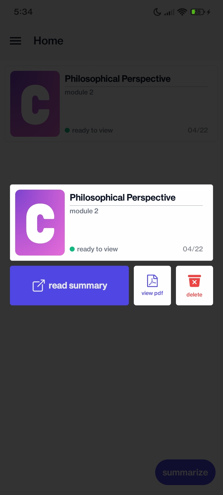
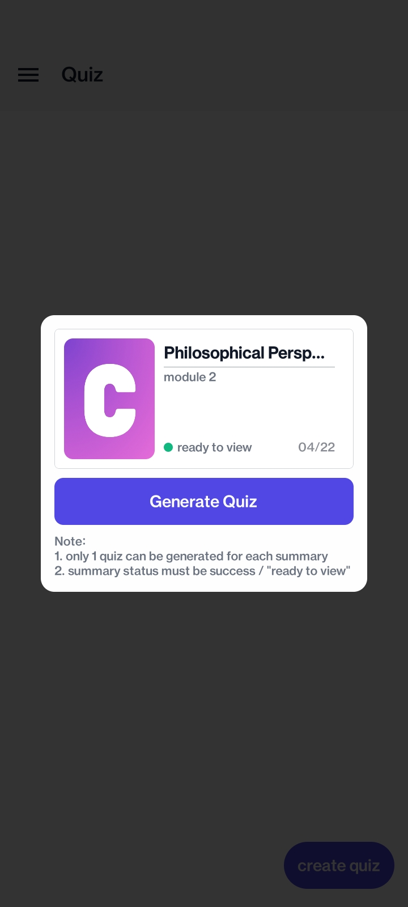
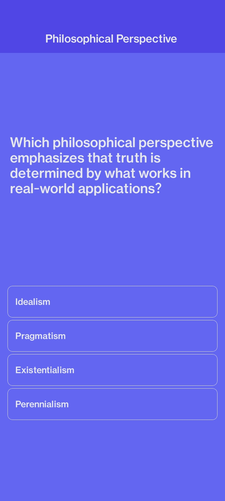

# Cut D' Crop v2.0.0
> Version 2.0.0 — Rebuilt. Redesigned. Smarter.

  

> An intelligent app designed to help students—and anyone else—learn more effectively by cutting through unnecessary content and focusing only on what truly matters.

---

## 📑 Table of Contents
- [📌 Introduction](#-introduction)
- [▶️ Demo](#-demo)
- [🖼️ Screenshots](#-screenshots)
- [🚀 Features](#-features)
- [📱 Download the App](#-download-the-app)
- [🛠️ Tech Stack](#-tech-stack)
- [📄 License](#-license)

---

## 📌 Introduction

> Welcome to Cut D' Crop —  
an intelligent app that helps you understand documents without wasting time on repetitive or unnecessary content.

> Wether you're studying for an exam, preparing for interviews, or simply want to learn something new without spending too much time, this app helps you:

> 1. 📘 Simplify your Documents 
> 2. ⚡ Learn Faster  and more efficient
> 3. 🧠 Strengthen retention through Quizzes

---

## 🎬 Demo (v2.0.0)
[▶️ Watch Demo](https://github.com/user-attachments/assets/de7549fa-ed77-4413-a63f-175eeb4b3e3f)

---

## 📸 Screenshots

  
  
  
  

---

## ✨ What’s New in v2.0.0

- 🔥 Completely redesigned user interface  
- ⚡  Migrated to Supabase for database and authentication
- 🚀 Improved performance and realtime updates
- 🧠 Enhanced AI summarization pipeline  
- 🛠️ Refactored internal architecture

---

## 🚀 Features

- 🤖 Document (PDF) Summarization using AI  
- 🧠 Document-based Quiz Generation using AI with highest score records  
- 🔐 SSO / email authentication  
- 🎯 Realtime Data State Updates  
- ⚙️ Background Task Processing  
- 🎨 Light and Dark mode

---

## 📱 Download the App

> You can download the latest version of Cut D' Crop directly from the link below:

👉 **[Download APK v2.0.0](https://github.com/saulanbrian/studyapp/releases/latest)**

_If installation is blocked, go to `Settings > Security` and enable `Install unknown apps`._

---

## 🛠️ Tech Stack

### 📱 Frontend
- **[React Native](https://reactnative.dev/)** 
- **[Expo](https://expo.dev/)**
- **[TypeScript](https://www.typescriptlang.org/)**  
- **[Reanimated](https://docs.swmansion.com/react-native-reanimated/)**  
- **[React Query](https://tanstack.com/query/v4)** (TanStack Query)  
- **[EAS Build](https://docs.expo.dev/eas/)** (Expo Application Services)

### 🌐 Backend
- **[Supabase](https://supabase.com/)** (Data management & Authentication)
- **[Django REST Framework](https://www.django-rest-framework.org/)** (API layer)  
- **[Celery](https://docs.celeryq.dev/)** + **[RabbitMQ](https://www.rabbitmq.com/)** (async tasks & broker)  
- **[Channels](https://channels.readthedocs.io/)** + **[Redis](https://redis.io/)** (WebSockets & realtime)  
- **[Ollama Cloud](https://docs.ollama.com/cloud)** (LLM for Document Summarizing and Quiz Generation)

---

## 📄 License

This project is licensed under the [MIT License](LICENSE).

---

> Made with ❤️ using Expo and Django. Built for learners who value their time.

